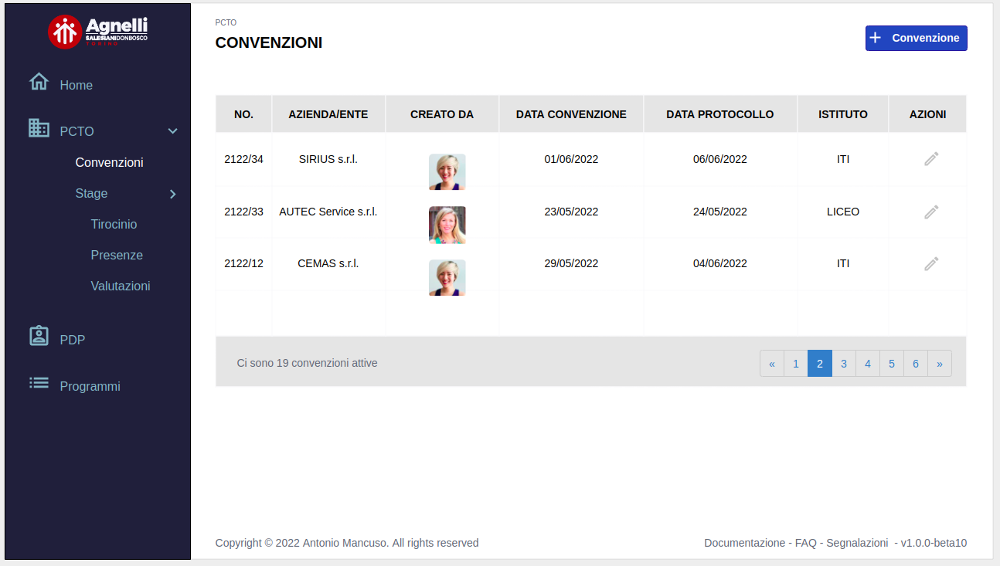
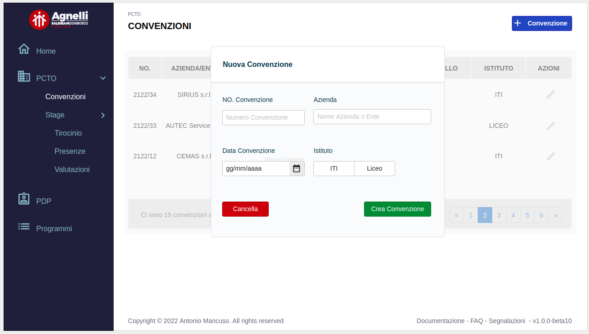
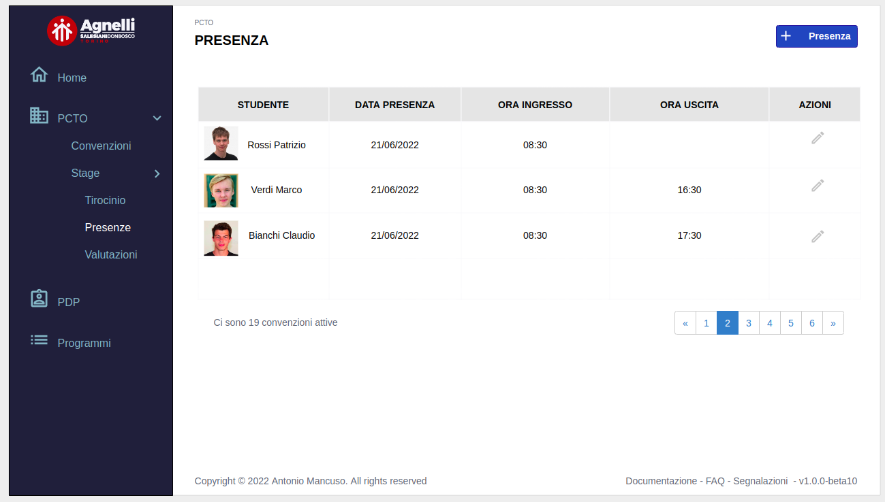

# SARP

Scuola Agnelli Resource Planning

## Cos'è SARP

- sistema di resource planning per l'istituto [Agnelli (TO)](https://agnelli.it/)

## Obiettivi

- creare un sistema di amministrazione e gestione dei principlai processi della scuola
- ridurre l'uso di documenti cartacei per snellire i processi e muoversi verso il concetto di **_papereless office_**
- agevolare le attività amministrative dei vari attori coinvolti (docenti, preside, amministrazione)
- "palestra" per gli studenti del triennio informatico per cimentarsi con un'attività non didattica di sviluppo software utilizzando moderne tecnologie web

### Team

| Studente  | Ore allocate  | Ruolo Principlae | Note  |
|:---:|:---:|:---:|:---:|
| Gcc  | 2  | DB & dev  | |
| Jon  | 5  |  Security & dev | |
| Furina  | 3  |  Security & dev | |
| Cello  | 2  |Senior dev   | |
| Rizzo  |  3 | Senior dev  | |
| Clang  | 3  | Junior dev & tester  | |
| Seba  | 2  | Junior dev & tester  | |
| Small | 3 |Junior dev & tester| |
| Liccia  | 2  | QA & testing  | |
| Peluso  | 2  | QA & testing  | |
 

## Mockup

